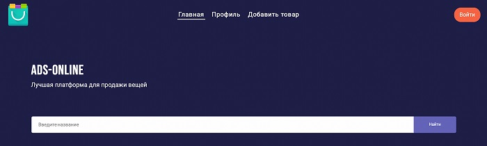

__Онлайн Магазин по перепродаже вещей на Java.__

     
------

---
## Проект платформы по перепродаже вещей 
## Комада разработчиков :

- [Молодцова Анна](https://github.com/renasafetysea)
- [Щербакова Анастасия](https://github.com/AnaSchD)
- [Касаткина Анастасия](https://github.com/Kastacey29)
- [Агуреева Галина](https://github.com/Galinaag4)

   ---------------

##  **В проекте используются**:

* Backend:
    - Java 17
    - Maven
    - Spring Boot
    - Spring Web
    - Spring Data
    - Spring JPA
    - GIT
    - REST
    - Swagger
    - Stream API
    - SQL:
    - PostgreSQL
    - Liquibase
    - Docker
